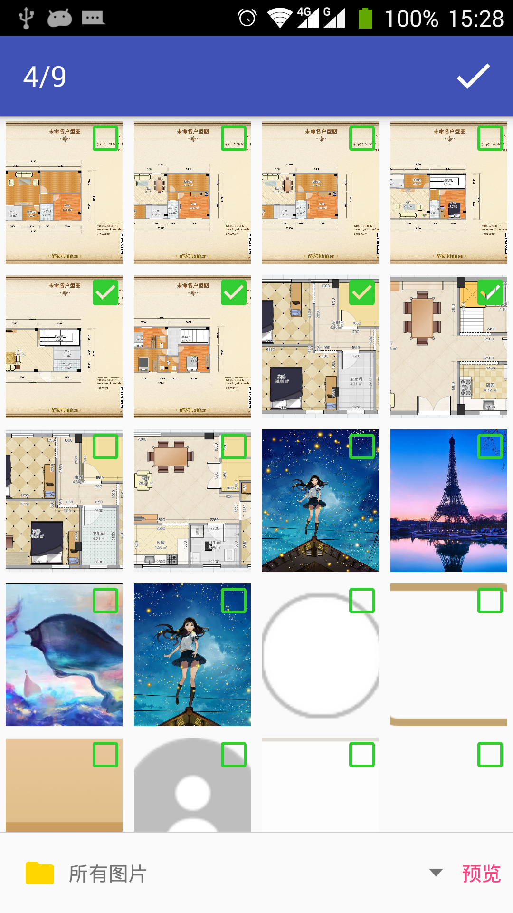
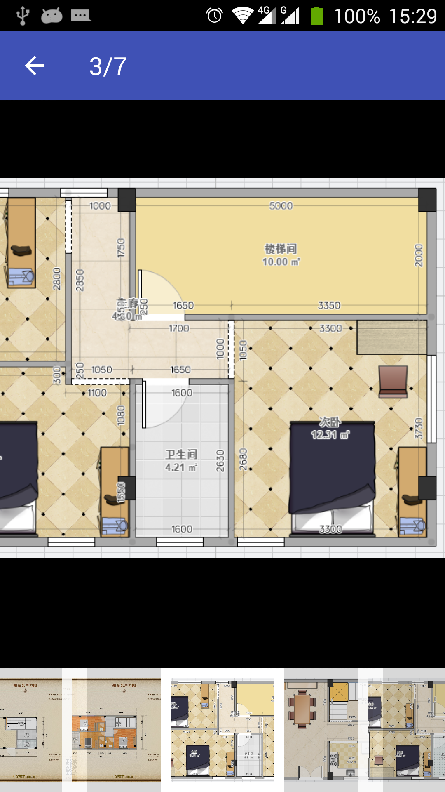

# PicSelector图片选择器

## 效果预览
  
## 实现
需要用到的库
```java
compile 'com.squareup.picasso:picasso:2.3.2'
compile 'com.android.support:appcompat-v7:26.1.0'
```
图片选择器大概思路：
- 使用Content Provider获取存储器中的图片文件路径，以及所在文件夹，并存储到相应List中
- 使用RecyclerView制作网格视图，并用Picasso加载图片，holder.itemView.setOnClickListener来监听图片是否被选中
- 使用Spinner制作文件夹选择器，然后setOnItemSelectedListener来监听当前选择的文件夹，并如改变文件夹，则重新获取该文件夹的图片，adapter.notifyDataSetChanged()更换网格视图中图片。
- 选择图片完毕后，返回图片路径数组到前一个onActivityResult中，并显示。

图片简易预览器大概思路：
- 采用Gallery显示图片选择器中选中图片的缩略图
- ImageView中显示当前图片的大图，并且使用OnTouchListener,Matrix和Bitmap实现图片放缩

## Module使用
导入后
```java
private final static int SELECT_OK = 0x1001;//ResultCode RequestCode
private final static String SELECT_IMAGES = "select_images";//在Bundle data中的Extra名字
private String[] selectImages;//接收选中图片路径数组

//打开图片选择器
Intent intent = new Intent(MainActivity.this, com.xld.picselector.PicSelectorActivity.class);
startActivityForResult(intent,SELECT_OK);

//获取选中图片路径数组
@Override
protected void onActivityResult(int requestCode, int resultCode, Intent data) {
super.onActivityResult(requestCode, resultCode, data);
if (requestCode == SELECT_OK && resultCode == SELECT_OK) {
selectImages = data.getStringArrayExtra(SELECT_IMAGES);
....
}
}
```